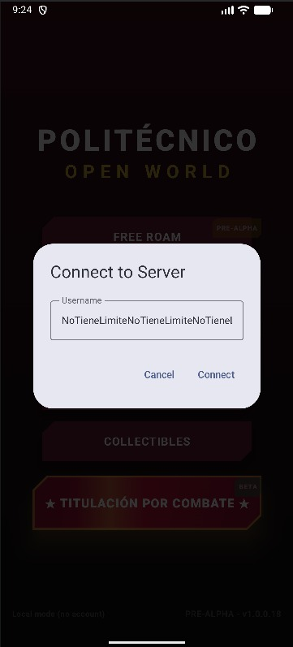
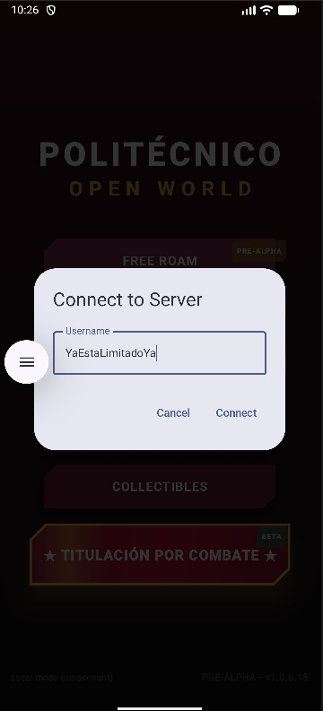
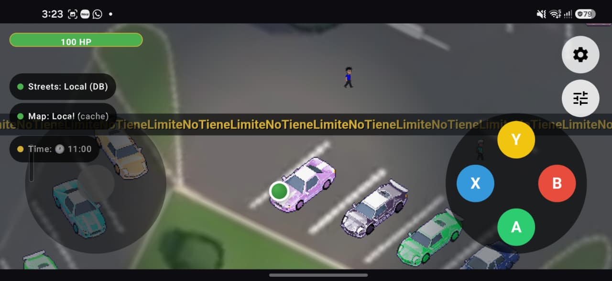
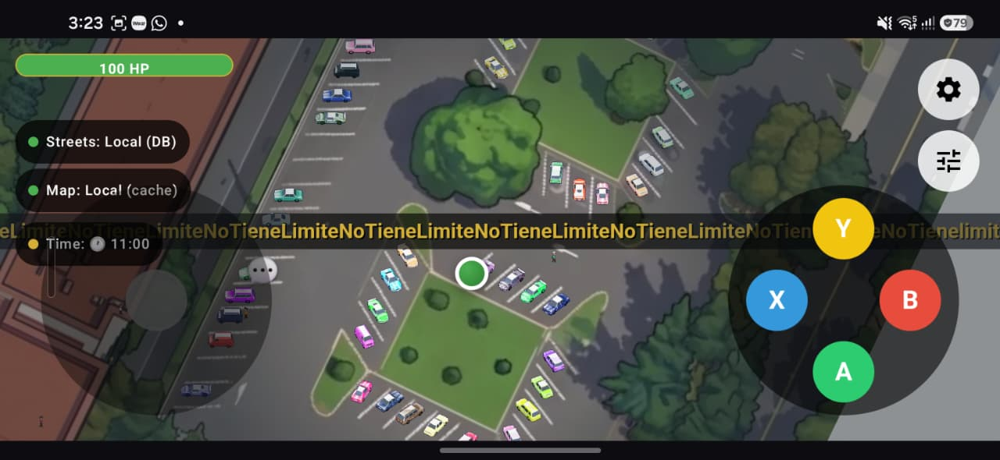
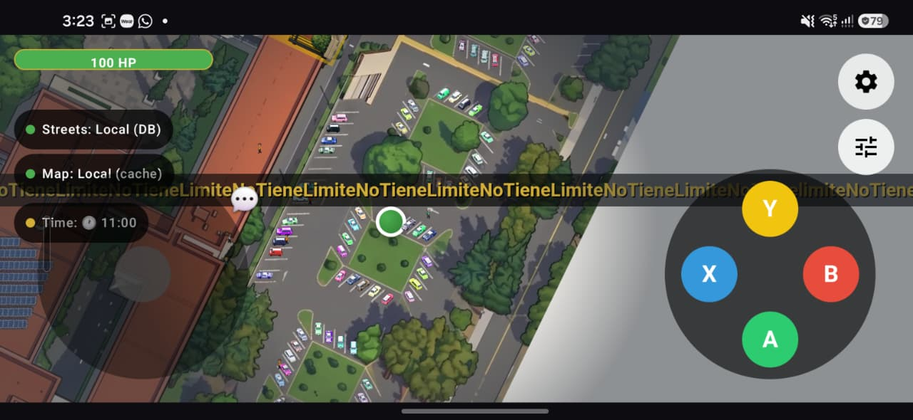
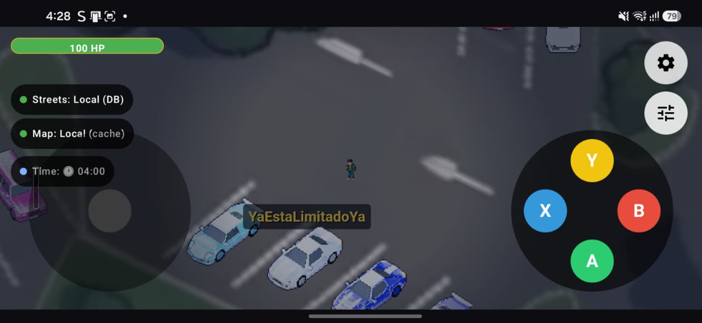

# QA Midterm — Mobile Apps: Multiplayer username length limit

Delivery index for the Quality Assurance project on
[gabrielhuav/PolitecnicoOpenWorld](https://github.com/gabrielhuav/PolitecnicoOpenWorld).
This document and the `docs/` folder live only on the academic branch `qa/entrega` of my fork;
they are not part of the game code or the Pull Request.

## 1. Team

| Member | GitHub user | Group |
|---|---|---|
| Diego Raymundo Hernández Alonso | [@DiegoRHA030427](https://github.com/DiegoRHA030427) | 7CV4 |

## 2. Goal

Limit the username typed in the Multiplayer *Connect to Server* dialog to **16 characters**,
so the label rendered above the player sprite no longer grows without bound and covers
other players' screens.

## 3. Scope

**In scope**

- *Username* field of the *Connect to Server* dialog (`MainMenuScreen.kt`, `shared` module).
- Input is capped at 16 characters while typing, and again when tapping *Connect*
  (covers a long name that was already saved).
- The `Jugador_XXXX` fallback name is kept when the field is left blank.

**Out of scope**

- Changes to the multiplayer server or the network message format.
- Validation of special characters or duplicate names.
- Other game modes (Free Roam, Story Mode, Titulación por Combate).

## 4. Traceability links

| Item | Link / value |
|---|---|
| Issue | [DiegoRHA030427/PolitecnicoOpenWorldExam1#1](https://github.com/DiegoRHA030427/PolitecnicoOpenWorldExam1/issues/1) |
| Pull Request | [gabrielhuav/PolitecnicoOpenWorld#167](https://github.com/gabrielhuav/PolitecnicoOpenWorld/pull/167) |
| Change branch | `fix/limit-multiplayer-username` |
| Base SHA | [`7ed325393f82872c2be94ff2ada46948efa19152`](https://github.com/gabrielhuav/PolitecnicoOpenWorld/commit/7ed325393f82872c2be94ff2ada46948efa19152) |
| Final delivered SHA | _Pending — declared when QA is closed._ |
| App version | `1.0.0.18` |

## 5. Test environment

| Item | Value |
|---|---|
| OS | Windows |
| IDE | Android Studio (bundled JBR) |
| Build | Gradle wrapper 9.5.0 · AGP 9.3.0 · Kotlin 2.3.21 · Java target 11 |
| Android SDK | compileSdk 36 · targetSdk 36 · minSdk 24 |
| Devices | Emulator *Medium Phone*, Android 17 (API 37), x86_64 · Physical Android phone |
| Setup | Fork synced with upstream `main` at the base SHA; only the internal `PolitecnicoOpenWorld` folder opened in Android Studio; fictitious usernames only; `local.properties` not committed |

## 6. Test matrix

Full matrix with steps, expected/actual results and evidence: **[docs/pruebas.md](docs/pruebas.md)**

| Case | Type | Covers | Status |
|---|---|---|---|
| CP-01 | Happy path | AC1, R1 | ✅ Passed |
| CP-02 | Boundary | AC2, R2 | ✅ Passed |
| CP-03 | Regression (blank-name fallback) | R3 | ✅ Passed |
| CP-04 | Navigation / state (Back, rotation) | — | ✅ Passed |
| CP-05 | Accessibility (max font size) | R4 | ✅ Passed |
| CP-06 | Compatibility (emulator vs phone) | — | ✅ Passed |

## 7. Evidence: before and after (CP-02, CP-06)

### 7.1 *Connect to Server* dialog

| Before (base SHA `7ed32539`) | After (fix branch) |
|---|---|
|  |  |
| The field accepts a name with no limit (`NoTieneLimiteNoTieneLimiteNoTiene…`). | The field stops at 16 characters (`YaEstaLimitadoYa`). |

### 7.2 Name label on the map (seen by another player)

**Before:** the unlimited name is drawn as a strip across the whole screen,
on top of the controls and the HUD.

| Capture 1 | Capture 2 | Capture 3 |
|---|---|---|
|  |  |  |

**After:** the label takes a bounded space next to the player.

## 8. Automated checks

| Check | What it verifies | SHA | Status | Log |
|---|---|---|---|---|
| PR Quality Gate (GitHub Actions) | Unit tests, detekt static analysis | `fbcd55cd` | _Pending — not yet run on the PR_ | — |
| Local Gradle run | `.\gradlew.bat :app:assembleDebug :app:testDebugUnitTest :shared:testAndroidHostTest --stacktrace` | `fbcd55cd` | _Pending_ | — |

## 9. Peer review

| Role | Link | Status |
|---|---|---|
| Review received on my PR | [PR #167](https://github.com/gabrielhuav/PolitecnicoOpenWorld/pull/167) | _Pending_ |
| Review I gave to a classmate | — | _Pending_ |

## 10. Conclusions

- The change meets both acceptance criteria: valid names are kept as typed and input stops at 16 characters.
- 6 of 6 test cases passed on the emulator (API 37) and on a physical phone; no defects found within scope.
- **Recommendation:** merge, once the automated checks pass.
- **Remaining risks:**
  - Pasting a long text into the field was not verified (out of scope for this change).
  - Users with a saved name longer than 16 characters will see it truncated on their next *Connect*.

## 11. Individual log

[docs/bitacora.md](docs/bitacora.md) — my commits, executed cases, peer review and AI tools used.

## 12. References

- [Upstream repository: gabrielhuav/PolitecnicoOpenWorld](https://github.com/gabrielhuav/PolitecnicoOpenWorld)
- [Working fork: DiegoRHA030427/PolitecnicoOpenWorldExam1](https://github.com/DiegoRHA030427/PolitecnicoOpenWorldExam1)
